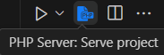
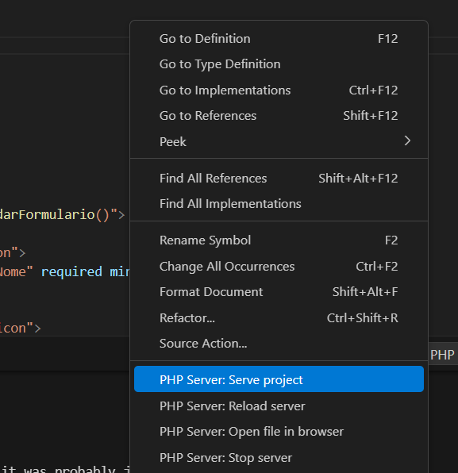

# Sistema CRUD PHP, MySQL e CSS

Esse projeto implementa um sistema CRUD utilizando PHP, MySQL e CSS para armazenar e gerenciar informações de membros de uma empresa.

## PRÉ-REQUISITOS

Para rodar o projeto localmente, você precisa dos seguintes programas instalados: 

- **XAMPP** (Pode ser utilizado também a extensão **PHPServer** do VSCode.)
- MySQL Workbench para gerenciar o banco de dados.

## Instruções de Instalação

**1. Clone o repositório:**
```bash 
git clone https://github.com/caioinsaxd/projeto-crud-desafio.git 
```

**2. Importe o banco de dados:**

- Abra o MySQL Workbench
- Crie um banco de dados, por exemplo, `projeto` ou `crud_membros`.
- Importe o arquivo de exportação do banco de dados na pasta `database`.
- Ou então forneça o script SQL para criar as tabelas.
```sql
CREATE TABLE x (
    id INT AUTO_INCREMENT PRIMARY KEY,
    nome VARCHAR(100),
    email VARCHAR(100),
    telefone VARCHAR(15),
);
```

**3. Configuração do Banco de Dados no PHP:**

Abra o arquivo `conexao.php` e edite as configurações de conexão com o banco de dados, caso necessário (usuário, senha, nome do banco, etc):


**4. Coloque os arquivos na pasta do servidor:**

Se estiver usando o XAMPP, coloque na pasta `htdocs` do mesmo.

**5. Rodando o servidor**

- Para XAMPP: Abra em modo admnistrador, inicie os módulos Apache e MySQL e acesse o sistema no seu navegador em `http://localhost/seu-diretorio/?`

- Para extensão PHPServer: Abra o arquivo `index.php` e procure pelo ícone azul no canto superior direito da tela, aperte e o navegador abrirá o arquivo automaticamente com o server ligado:



Ou então, aperte com o botão direito na página de código de qualquer arquivo php do projeto e aperte em `PHP Server: Serve project`:



## Como Usar

- Adicione, edite ou exclua um membro do time através da interface web.

## Tecnologias usadas

- PHP para backend.
- MySQL para banco de dados.
- CSS para estilização.
- HTML para estrutura.
